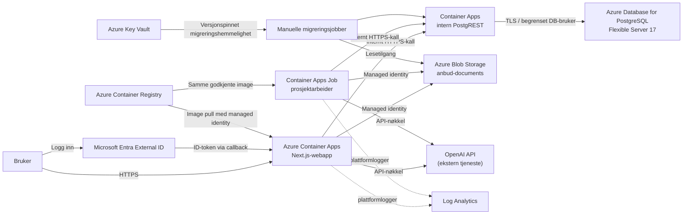

# Azure-tjenester i Anbud

Sist verifisert: 14. august 2026
Omfang: produksjonsmiljøet `anbud-prod` i Norway East, tilhørende External ID-tenant og infrastrukturen i dette repoet.

## Formål

Dette dokumentet forklarer hvilke Azure-tjenester Anbud bruker, hvorfor de er valgt, og hvordan de inngår i løsningen. Status er kontrollert både mot Bicep- og applikasjonskoden og mot ressursene som er deployet i Azure.

Dokumentet skiller mellom:

- **Aktiv**: tjenesten er deployet og inngår i den ordinære produksjonsflyten.
- **Kontroll/beredskap**: tjenesten er deployet, men brukes bare ved migrering, aktivering, deaktivering eller rollback.
- **Valgfri, ikke aktiv**: applikasjonen støtter tjenesten, men den er ikke konfigurert i produksjon nå.
- **Ikke Azure**: en viktig avhengighet som det er lett å forveksle med en Azure-tjeneste.

## Kort oppsummering

Den aktive produksjonsløsningen kjører Next.js-applikasjonen i Azure Container Apps. Containerbilder lagres i Azure Container Registry. Brukere logger inn gjennom Microsoft Entra External ID. Applikasjonen bruker en intern PostgREST-instans i Container Apps som data-API mot Azure Database for PostgreSQL Flexible Server, og dokumentfiler lagres kryptert i Azure Blob Storage. En tidsstyrt Container Apps Job behandler langvarige dokument- og AI-jobber. Logger fra Container Apps-miljøet sendes til Log Analytics.

Azure Key Vault og tre manuelle Container Apps Jobs er avgrenset til migreringskontroll og beredskap. Azure Communication Services Email og Azure AI Document Intelligence støttes av koden, men er ikke deployet eller aktivert i den verifiserte produksjonskonfigurasjonen.

OpenAI-kall går til OpenAI API med `OPENAI_API_KEY`; løsningen bruker ikke Azure OpenAI Service.

## Arkitekturoversikt

## Tjenesteoversikt

| Azure-tjeneste | Status | Hvorfor den brukes | Hvordan den brukes |
| --- | --- | --- | --- |
| Azure Container Apps | Aktiv | Kjøre webappen som container uten å drifte Kubernetes | Offentlig Next.js-app med HTTPS-ingress, flere revisjoner og autoskalering fra 0 til 3 replikaer |
| Azure Container Apps Jobs | Aktiv + kontroll/beredskap | Kjøre bakgrunnsarbeid og avgrensede migreringsoperasjoner | Én jobb kjører hvert femte minutt; tre separate jobber startes kun manuelt ved migreringskontroll |
| Azure Container Registry | Aktiv | Privat lagring og distribusjon av godkjente containerbilder | Web, worker, PostgREST og kontrolljobber bruker digest-pinnede images; ACR-passord er ikke i bruk |
| Microsoft Entra External ID | Aktiv | Standardisert Microsoft-innlogging for interne brukere | Server-side OAuth/OIDC-flyt via MSAL og callback i applikasjonen |
| Managed Identities + Azure RBAC | Aktiv | Unngå varige nøkler for ACR og Blob Storage | Egen pull-identitet for ACR, systemidentiteter for web/worker og egen kontrollidentitet for migrering |
| Azure Database for PostgreSQL Flexible Server | Aktiv | Relasjonsdatabase for prosjekter, brukere, roller, jobber, dokumentmetadata og RAG-data | PostgreSQL 17 nås kun gjennom intern PostgREST i ordinær applikasjonsflyt |
| Azure Blob Storage | Aktiv | Lagring av opplastede dokumenter uten å legge binærdata i databasen | Privat dokumentcontainer, OAuth/managed identity og 14 dagers soft delete |
| Azure Log Analytics | Aktiv | Samle plattform- og containerlogger sentralt | Container Apps-miljøet sender logger til workspace `anbud-logs` med 30 dagers retention |
| Azure Key Vault | Kontroll/beredskap | Beskytte den uavhengige PostgREST-hemmeligheten under migreringskontroll | Manuelle kontrolljobber leser én eksplisitt versjon av hemmeligheten gjennom egen managed identity |
| Azure Cost Management Budget | Aktiv | Varsle før kostnadene overskrider avtalt nivå | Månedlig budsjett på 600 i abonnementets faktureringsvaluta med terskler på 50, 80 og 100 prosent samt 100 prosent prognose |
| Azure Communication Services Email | Valgfri, ikke aktiv | Sende personlige gjestekoder på e-post | Koden støtter endpoint + managed identity, men produksjonen har ikke tjenesten eller miljøvariablene konfigurert |
| Azure AI Document Intelligence | Valgfri, ikke aktiv | OCR/layout som siste utvei for dokumenter med svak lokal ekstraksjon | Endpoint og nøkkel er ikke konfigurert; lokal parser og Docling brukes i stedet |

## Hvordan de aktive tjenestene brukes

### Azure Container Apps

`anbud` er den offentlig tilgjengelige webappen. Den kjører Next.js på port 3000 og eksponerer kun HTTPS. Aktiv revisjonsmodus er `Multiple`, slik at en ny revisjon kan testes før trafikken flyttes. Produksjon har nå én frisk revisjon med 100 prosent trafikk.

Skalering er satt til:

- minimum 0 replikaer for å redusere tomgangskostnad;
- maksimum 3 replikaer;
- HTTP-basert skalering ved økende samtidighet.

Konsekvensen av minimum 0 er at første forespørsel etter inaktivitet kan få kaldstart. Liveness-proben bruker `/api/health/live` og tester bare om prosessen lever. Readiness og den detaljerte helsemodellen er egne endepunkter, slik at feil hos PostgreSQL eller OpenAI ikke automatisk fører til unødvendig omstart av en ellers frisk container.

`anbud-postgrest` er en separat Container App i samme managed environment. Den har kun intern ingress og er derfor ikke tilgjengelig direkte fra Internett. Den bevarer applikasjonens eksisterende PostgREST/RPC-kontrakt samtidig som databasen ligger i Azure. Den skalerer fra 0 til maksimalt 1 replika og bruker en liten databasepool for å beskytte den valgte PostgreSQL-størrelsen.

Relevant infrastruktur: [`infra/azure/container-app.bicep`](../infra/azure/container-app.bicep) og [`infra/azure/postgrest.bicep`](../infra/azure/postgrest.bicep).

### Azure Container Apps Jobs

`anbud-project-job-worker` kjører planlagt hvert femte minutt. Den henter høyst én prosjektjobb per kjøring og utfører blant annet dokumentforbedring, analyse og annet arbeid som ikke bør blokkere et webkall. Worker bruker samme godkjente applikasjonsimage som webrevisjonen etter vellykket utrulling, men har 2 CPU, 4 GiB minne og opptil 35 minutters kjøretid for tyngre Docling-jobber.

Tre manuelle jobber er deployet som sikkerhetsmekanismer rundt datamigreringen:

- `anbud-migration-control` verifiserer målmiljø og migreringsbevis;
- `anbud-migration-activate` aktiverer et allerede validert Azure-mål;
- `anbud-migration-deactivate` fryser Azure-målet før kontrollert repetisjon eller rollback.

De manuelle jobbene har ingen planlagt trigger, ingen tomgangskjøring og ingen automatisk retry. De skal ikke brukes som ordinære applikasjonsarbeidere.

### Azure Container Registry

Registry `anbudprod9841703` lagrer private images for webappen og PostgREST. Produksjonsimages refereres med SHA-256-digest, ikke en flyttbar tag. Dette gjør utrulling og rollback reproduserbar: samme referanse gir samme image.

ACR admin-brukeren er deaktivert. Pull skjer med den dedikerte user-assigned identity-en `anbud-acr-pull`, som har rollen `AcrPull` på registryet. Dermed trenger verken Container Apps eller GitHub å lagre et ACR-passord.

ACR bruker Basic SKU og har offentlig nettverkstilgang. Autorisasjon skjer med Microsoft Entra/RBAC.

Relevant bootstrap: [`infra/azure/acr-pull-bootstrap.bicep`](../infra/azure/acr-pull-bootstrap.bicep).

### Microsoft Entra External ID

External ID-tenant `bidsiteexternal.onmicrosoft.com` er identitetsleverandør for Microsoft-innlogging. Applikasjonen bruker MSAL Node og en server-side callback på `/api/auth/microsoft/callback`.

Flyten er:

1. Brukeren sendes til tenantens Microsoft-innlogging.
2. Microsoft returnerer et ID-token til callback-ruten.
3. Applikasjonen validerer tokenet og kobler Microsoft-subjektet til en intern applikasjonsidentitet.
4. Applikasjonen oppretter en ugjennomsiktig, tilbakekallbar databaseøkt og setter en HttpOnly-cookie.

Supabase Auth brukes ikke i denne innloggingsflyten. Gjestebrukere opprettes heller ikke i Entra; de bruker applikasjonsforvaltede gjestekoder.

Detaljer: [`docs/microsoft-entra-login.md`](microsoft-entra-login.md) og [`docs/guest-access-rbac-and-insights.md`](guest-access-rbac-and-insights.md).

### Managed Identities og Azure RBAC

Løsningen bruker identiteter med ulike oppgaver:

- `anbud-acr-pull`: user-assigned identity som bare trekker images fra ACR;
- webappens system-assigned identity: leser og skriver dokumenter i `anbud-documents`;
- workerens system-assigned identity: leser og skriver dokumenter i samme container;
- `anbud-migration-control`: user-assigned identity med lesetilgang til Key Vault-hemmeligheten, dokumentcontaineren og den separate evidenscontaineren.

Tilgangene er gitt på lavest praktiske scope. Web og worker får `Storage Blob Data Contributor` på dokumentcontaineren, ikke på hele abonnementet. Kontrollidentiteten får `Storage Blob Data Reader` og `Key Vault Secrets User`, fordi kontrollflyten bare skal verifisere data og hente sin versjonspinnede hemmelighet.

### Azure Database for PostgreSQL Flexible Server

Server `anbud-prod-pg-9841703` er den aktive databasen. Produksjonskonfigurasjonen er:

- PostgreSQL 17;
- Burstable `Standard_B1ms`;
- 32 GiB lagring;
- 7 dagers point-in-time restore;
- ingen high availability og ingen geo-redundant backup;
- storage auto-grow deaktivert;
- utvidelsene `pgcrypto` og `vector` tillatt.

Databasen inneholder blant annet prosjektdata, tilgangsstyring, aktivitetsdata, dokumentmetadata, jobbkø og vektor-/RAG-data. Web og worker kobler ikke direkte til PostgreSQL. De bruker den interne PostgREST-broen, som kobler med en avgrenset authenticator-bruker og kan bytte til database-rollen `service_role` etter validering av JWT.

Serveren har offentlig nettverksendepunkt, men brannmuren har en eksplisitt IP-regel og ingen «Allow Azure services»-regel. Dette er et kostnadsbevisst design uten VNet/private endpoint; databaseautentisering og TLS er fortsatt påkrevd. Valgt B1ms-størrelse er et kostnadsnivå, ikke et høytilgjengelig mission-critical nivå.

Relevant infrastruktur: [`infra/azure/postgres.bicep`](../infra/azure/postgres.bicep) og [`infra/azure/postgres/bootstrap.sql`](../infra/azure/postgres/bootstrap.sql).

### Azure Blob Storage

Storage account `anbudprod9841703data` er aktiv fillagring. Den bruker StorageV2, Standard LRS og Hot tier. To private containere finnes:

- `anbud-documents` for applikasjonens dokumenter;
- `anbud-migration-evidence` for separat, digest-pinnet migreringsbevis.

Dokumenter krypteres av applikasjonen før opplasting og lagres som binære objekter under deterministiske objektstier. Databaseposten lagrer referansen til container og sti. Web og worker bruker `DefaultAzureCredential`, som i Azure løses til workloadens managed identity.

Shared Key og offentlig blobtilgang er deaktivert, OAuth er standard og minimum TLS-versjon er 1.2. Blob- og containersletting har 14 dagers soft delete. Versjonering er deaktivert for å begrense kostnadsvekst ved hyppige oppdateringer.

Selve storage-endepunktet har offentlig nettverkstilgang fordi samme-region IP-regler ikke passer denne kostnadsarkitekturen. Objektene er likevel private, og datatilgang krever Azure RBAC. Et privat endepunkt ville kreve en VNet-integrert Container Apps-arkitektur og er et eget kostnads- og nettverksvalg.

Relevant infrastruktur og kode: [`infra/azure/storage.bicep`](../infra/azure/storage.bicep) og [`apps/frontend/lib/server/azure-blob-storage.ts`](../apps/frontend/lib/server/azure-blob-storage.ts).

### Azure Log Analytics

Log Analytics workspace `anbud-logs` mottar logger fra Container Apps managed environment. Retention er 30 dager og SKU er `PerGB2018`.

Dette gir et sentralt sted for container- og plattformlogger, feilsøking av revisjoner og jobbkjøringer. Applikasjonen sender også korrelasjons-ID i forespørsler, slik at hendelser kan følges på tvers av ruter.

Det er ikke opprettet Application Insights, Azure Monitor-workbooks eller eksplisitte alert rules i den verifiserte ressurslisten. Log Analytics er derfor logggrunnlaget, men komplett dashboarding, syntetiske tester og varsling må fortsatt etableres separat dersom det er et driftskrav.

### Azure Key Vault

Key Vault `anbud-prod-kv-9841703` brukes av migreringskontrolljobbene til å hente den separate JWT-hemmeligheten for PostgREST. Jobbdefinisjonen peker på en bestemt Key Vault-versjon, slik at en rotasjon ikke stille endrer hemmeligheten midt i en kontrollert cutover.

Vaultet bruker Azure RBAC, soft delete og purge protection. Den er ikke generell secret store for webappen i dagens arkitektur. Web- og worker-hemmeligheter ligger som Container Apps secrets og mates inn fra det beskyttede GitHub-miljøet ved deploy. Dette skillet er viktig når hemmelighetsrotasjon og operativt ansvar beskrives.

Relevant infrastruktur: [`infra/azure/migration-control.bicep`](../infra/azure/migration-control.bicep).

### Azure Cost Management Budget

Budsjettet `anbud-monthly-cost` er satt til 600 per måned i abonnementets faktureringsvaluta. Det varsler ved 50, 80 og 100 prosent faktisk forbruk og ved 100 prosent prognostisert forbruk.

Et Azure-budsjett stopper ikke ressurser og er ikke en hard kostnadsgrense. Det gir tidlig varsling slik at eier kan vurdere skalering, loggvolum, worker-frekvens og doble kostnader i en rollbackperiode.

Relevant infrastruktur: [`infra/azure/budget.bicep`](../infra/azure/budget.bicep).

## Valgfrie Azure-tjenester som ikke er aktive

### Azure Communication Services Email

Applikasjonen kan sende gjestekoder gjennom Azure Communication Services Email. Foretrukket produksjonsmønster er endpoint + webappens managed identity, mens connection string kun er en lokal utviklingsmulighet.

Det finnes ingen Communication Services- eller Email Communication Services-ressurs i det verifiserte abonnementet, og de nødvendige miljøvariablene er ikke satt på den aktive Container App-revisjonen. Invitasjonsflyten må derfor vise eller overføre koden gjennom en annen godkjent kanal inntil tjenesten blir etablert.

Aktivering er beskrevet i [`docs/guest-access-rbac-and-insights.md`](guest-access-rbac-and-insights.md).

### Azure AI Document Intelligence

Applikasjonen har en kvalitetsruter som kan bruke Azure AI Document Intelligence Layout når lokal dokumentekstraksjon gir svak kvalitet. High Resolution OCR kan stå i `auto`, slik at den betalte funksjonen bare brukes når kvalitetsscoren tilsier det.

Produksjonen har ikke et Document Intelligence-endpoint, og `DOCUMENT_ANALYSIS_VERSION` er satt til `off`. Dagens aktive dokumentflyt bruker derfor lokale parse-/Docling-mekanismer og eventuelle OpenAI-analyser, ikke Azure AI Document Intelligence.

## Eksterne tjenester som ikke er Azure

### OpenAI API

Web og worker bruker OpenAI API til blant annet generering, analyse, embeddings, RAG-query rewrite og tilbudsrelaterte AI-flyter. Autentisering skjer med `OPENAI_API_KEY`, og aktiv standardmodell er `gpt-5.4`.

Dette er direkte bruk av OpenAI API, ikke Azure OpenAI Service. Det er ikke deployet en `Microsoft.CognitiveServices/accounts`-ressurs i abonnementet. Dersom løsningen senere skal bruke Azure OpenAI, må endpoint, autentisering, modell-deployments, SDK-konfigurasjon og dataflyt endres eksplisitt.

### Supabase i rollbackperioden

Den aktive applikasjonsrevisjonen har `FILE_STORAGE_BACKEND=azure` og intern `DATA_API_URL`, så ordinære data- og filoperasjoner går til Azure. Supabase URL og service-role-hemmelighet finnes fortsatt i revisjonen som kontrollert fallback/rollbackavhengighet.

Etter formell avslutning av rollbackperioden bør en ny revisjon deployes uten Supabase-referanser før upstream-legitimasjonen trekkes tilbake. En hemmelighet må ikke slettes mens en aktiv eller rollbackbar revisjon fortsatt refererer til den.

## Viktige dataflyter

### 1. Innlogging

`Bruker → Entra External ID → callback i webappen → intern PostgREST → PostgreSQL-økt → HttpOnly-cookie`

Entra bekrefter identiteten. Applikasjonen, ikke Entra, avgjør prosjektroller og oppretter den tilbakekallbare applikasjonsøkten.

### 2. Ordinære prosjektoperasjoner

`Nettleser → offentlig Container App → intern PostgREST → Azure PostgreSQL`

Nettleseren får aldri databasehemmeligheten. Alle service-role-kall skjer på serversiden, og PostgREST kan ikke nås fra offentlig Internett.

### 3. Dokumentopplasting

`Nettleser → webapp → applikasjonskryptering → Blob Storage → metadata i PostgreSQL`

Selve dokumentet lagres i Blob Storage. PostgreSQL lagrer referansen og behandlingsmetadata. Bare den konfigurerte private containeren godtas av storage-adapteren.

### 4. Bakgrunnsbehandling

`Container Apps-scheduler → project-job-worker → PostgreSQL/PostgREST + Blob Storage + OpenAI`

Worker gjør tungt eller langvarig arbeid uten å holde et brukerens HTTP-kall åpent. Lås-, lease- og jobbstyring ligger i databasen.

### 5. Produksjonsdeploy

`GitHub Actions → OIDC-login til Azure → bygg/scan → push til ACR → kandidat-revisjon → health smoke → trafikkflytting → worker-oppdatering`

Workflowen bruker et beskyttet `production`-miljø og federert OIDC-token (`id-token: write`). Nye images er digest-pinnet. Kandidaten testes på revisjonens egen adresse før den får produksjonstrafikk. Dersom testen feiler, beholdes forrige revisjon; ved feil etter promotering rulles både web og worker tilbake.

Workflow: [`.github/workflows/deploy-azure.yml`](../.github/workflows/deploy-azure.yml).

## Sikkerhets- og driftsvalg

- Produksjonsressursene ligger hovedsakelig i `norwayeast` for lavere latenstid og enklere dataflyt.
- Offentlig trafikk går bare til webappens HTTPS-ingress. PostgREST er intern.
- ACR-pull og Blob-tilgang bruker managed identity; Shared Key og ACR admin-bruker er deaktivert.
- Containerimages er pinnet med digest.
- PostgreSQL bruker TLS, avgrenset runtime-bruker og eksplisitt IP-brannmurregel.
- Migreringsbevis lagres separat fra dokumentinventaret.
- Key Vault-hemmeligheten er versjonspinnet og tilgjengelig bare for kontrollidentiteten.
- Webappen kan skalere til null, som reduserer kostnad men gir mulig kaldstart.
- PostgreSQL har ikke HA eller geo-backup. Dagens oppsett prioriterer kostnad foran høy tilgjengelighet.
- Storage bruker LRS, så data replikeres i ett Azure-datasenterområde, ikke på tvers av regioner.
- Log Analytics samler logger, men alarmer og dashboards er ikke ferdig etablert i IaC.

## Konfigurasjon som avgjør aktiv arkitektur

| Variabel | Aktiv verdi/rolle | Betydning |
| --- | --- | --- |
| `FILE_STORAGE_BACKEND` | `azure` | Azure Blob Storage er aktiv fillagring |
| `DATA_API_URL` | Intern `anbud-postgrest`-adresse | Azure/PostgreSQL er aktiv databasebane |
| `AZURE_STORAGE_ACCOUNT_URL` | Blob-endpointet | Konto som web og worker når med managed identity |
| `AZURE_STORAGE_CONTAINER` | `anbud-documents` | Eneste tillatte runtime-container |
| `MICROSOFT_ENTRA_*` | Konfigurert | Entra External ID er aktiv innlogging |
| `OPENAI_API_KEY` | Container App secret | Direkte OpenAI API er aktiv AI-leverandør |
| `DOCUMENT_ANALYSIS_VERSION` | `off` | Versjonert v3-dokumentanalyse er ikke aktivert |
| `AZURE_DOCUMENT_INTELLIGENCE_ENDPOINT` | Ikke satt | Azure AI Document Intelligence brukes ikke |
| `AZURE_COMMUNICATION_EMAIL_ENDPOINT` | Ikke satt | Azure Communication Services Email brukes ikke |

Ingen hemmelige verdier skal lagres i repoet eller gjengis i dokumentasjon. `.env.example` viser kun navn og forventet form: [`.env.example`](../.env.example).

## Begrensninger og anbefalte oppfølgingspunkter

1. Etabler Azure Monitor-varsler og dashboards for webrevisjoner, jobbfeil, PostgreSQL-kapasitet, Blob-feil og helseendepunktene.
2. Avklar SLO, RTO og RPO før PostgreSQL eventuelt oppgraderes til General Purpose, zone-redundant HA eller lengre backup.
3. Avslutt Supabase rollbackavhengigheten gjennom den dokumenterte, ordnede oppryddingen når rollbackvinduet er formelt lukket.
4. Vurder om web- og worker-hemmeligheter skal flyttes fra Container Apps secrets til Key Vault etter en egen rotasjons- og driftsanalyse.
5. Aktiver Communication Services Email bare dersom e-postlevering av gjestekoder er et krav, og bruk managed identity med minst mulig rolle.
6. Aktiver Azure AI Document Intelligence bare etter kvalitetstest og kostnadsgrense; lokal parser og Docling dekker normalflyten i dag.
7. Vurder privat nettverk/VNet-integrasjon bare dersom sikkerhets- eller compliancekrav forsvarer kostnad og kompleksitet.

## Kilder i repoet

- [`infra/azure/README.md`](../infra/azure/README.md) – deploy og operativ kontroll.
- [`docs/azure-migration.md`](azure-migration.md) – migrerings-, cutover-, rollback- og oppryddingsløp.
- [`docs/mission-critical-azure-review.md`](mission-critical-azure-review.md) – Azure Well-Architected-vurdering og kjente utsettelser.
- [`infra/azure/container-app.bicep`](../infra/azure/container-app.bicep) – web, worker, Container Apps environment og Log Analytics.
- [`infra/azure/postgrest.bicep`](../infra/azure/postgrest.bicep) – intern data-API-bro.
- [`infra/azure/postgres.bicep`](../infra/azure/postgres.bicep) – PostgreSQL-server og brannmur.
- [`infra/azure/storage.bicep`](../infra/azure/storage.bicep) – Blob Storage, containere og RBAC.
- [`infra/azure/migration-control.bicep`](../infra/azure/migration-control.bicep) – Key Vault-integrasjon og manuelle kontrolljobber.
- [`.github/workflows/deploy-azure.yml`](../.github/workflows/deploy-azure.yml) – validering, deploy, cutoverkontroll og rollback.
