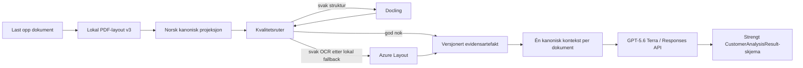

# Document Analysis v3

## Resultat

V3 gjør dokumentanalyse til én versjonert dataflyt: lokal parsing, konservativ
norsk kanonisering, kvalitetsruting, kryptert evidensartefakt og ett
skjemabundet AI-kall. Rå kildetekst beholdes uendret for revisjon og sitater;
kanonisk tekst brukes til gjenfinning og analyse.

V3 fjerner det tidligere andre Docling-løpet for PDF. Kvalitetsruteren eier nå
eskalering og fallback, slik at samme fil ikke parses, lagres og indekseres to
ganger. Nye analyser med ferske v3-artefakter hopper også over semantisk
retrieval: den samme evidensen sendes ikke lenger som råtekst, kompilert
kontekst og retrieval-utdrag samtidig. Eldre dokumenter bruker den eksisterende
fallbacken til de er reindeksert.

## Norsk tekstkvalitet

Hver blokk har to eksplisitte representasjoner:

- `sourceText`: uendret parsertekst for sitat, revisjon og ny prosessering;
- `canonicalText`: konservativ bokmålsprojeksjon for analyse og søk.

Kanoniseringen reparerer kjente mojibake-tegn, soft hyphen, ord som er delt ved
linjeslutt, mellomrom rundt tegnsetting, norske krav-ID-er og sikre
sammenlimingsfeil. Strukturerte `Kravtekst`-celler er autoritative når en
generert rad bare er et avkortet prefiks. En ny sikkerhetsregel avviser samtidig
nabopunkter som starter med ny punktmarkør eller følger etter avsluttet setning.

Den deterministiske fasiten med 50 norske PDF-er og 3 505 krav oppnår:

| Mål | V2 | V3 |
|---|---:|---:|
| Nøyaktig kravantall | 100 % | 100 % |
| Strengt teksttreff | 99,9 % (3 501/3 505) | **100 % (3 505/3 505)** |
| Justert teksttreff | 100 % | 100 % |
| ID-kvalitet | 92,5 % | 92,5 % |
| Overskriftskvalitet | 99,5 % | 99,5 % |
| Gjennomsnittlig PDF-parse | 357 ms baselinekjøring | 412 ms verifikasjonskjøring |

Parse-tid varierer med maskinlast (P90 var 649 ms); den funksjonelle porten er
3 505 av 3 505 eksakte kravtekster. Universell språkperfeksjon kan ikke bevises for ukjente
eller skannede dokumenter, derfor måles diagnostikk og svak OCR eskaleres i
stedet for å bli «rettet» ved gjetning.

## AI-analyse

Kundeanalyse bruker som standard `gpt-5.6-terra` bare i v3-flyten. Andre
AI-funksjoner beholder sine eksisterende modellvalg. Kallet bruker Responses
API, lav resonneringsinnsats, middels tekstverbosity, strengt JSON Schema og
`store: false`. Den brede globale systemprompten og eksplisitt
cache-retention er ikke med i denne ruten.

Den korte prompten krever et internt kilderegister før skriving: kunde og
kjøpsdriver, mål, omfang, absolutte krav, evalueringsvekter, SLA/RTO/RPO,
sikkerhet, alle leveranser og datoer, kommersielle bindinger, ansvar,
avhengigheter og åpne avklaringer. Norske analysetekster bruker norsk
desimal- og enhetsnotasjon, mens ordrette kildeutdrag forblir uendret.

### Målt A/B 23. juli 2026

Tre innsjekkede tender-PDF-er ble analysert med tre kandidater. GPT-5.6 Sol
bedømte anonymiserte og motbalanserte svar mot både referansetekst og kanonisk
PDF-kontekst. Alle kall brukte lav resonneringsinnsats og strengt skjema.

| Mål | GPT-5.4 + legacy | Terra + legacy | Terra + v3 |
|---|---:|---:|---:|
| Førsteplass | 0/3 | 0/3 | **3/3** |
| Dommersnitt, 9 dimensjoner | 7,89 | 8,63 | **9,33** |
| Fullstendighet | 7,67 | 8,67 | **10,00** |
| Spesifisitet | 8,67 | 9,00 | **10,00** |
| Sporbarhet | 8,00 | 8,00 | **10,00** |
| Nøyaktig implisitt kildeutdrag | 1/9 | 0/9 | **9/9** |
| Input-tokens, tre dokumenter | 16 677 | 16 677 | **8 310** |
| Gjennomsnittlig generering | 66,9 s | 43,3 s | **33,5 s** |
| Genereringskostnad | USD 0,2218 | USD 0,1843 | **USD 0,1730** |

V3 hadde fire konservative, automatiske tegnsettingsflagg mot henholdsvis 17
og 11; den uavhengige dommeren ga v3 9/10 for tegnsetting og grammatikk.
Ingen kandidat oppfant tjenester da kandidatlisten var tom, og alle fordelte
den interne verdiestimeringen til 100 prosent.

Samlet OpenAI-forbruk for canary, første funnrunde og endelig A/B var
**USD 2,1142 av godkjente USD 15**. Den endelige rapporten genereres lokalt til
`reports/document-analysis-v3-eval.md`; rapportmappen er ignorert fordi den kan
inneholde evalueringsoutput.

## Utrulling og rollback

1. Sett `DOCUMENT_ANALYSIS_VERSION=v3` i en canary-revisjon.
2. Behold `OPENAI_DOCUMENT_ANALYSIS_MODEL=gpt-5.6-terra` med mindre en ny,
   versjonert A/B begrunner en endring.
3. Reindekser eksisterende dokumenter for å opprette artefakter med compiler
   `document-analysis.3.0.0`. Dokumenter uten fersk artefakt bruker legacy.
4. Følg parserrute, språkanomalier, kontekstmodus, prompttegn, modell og
   regenerering i metadatahendelser. Ingen dokumenttekst lagres i eventtabellen.
5. Rollback er `DOCUMENT_ANALYSIS_VERSION=off`. Kryptert råtekst, strukturkart,
   chunks og tidligere artefakter forblir intakte.
