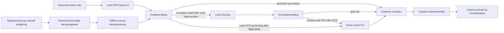

# Dokumentintelligens v2: evidence compiler

> Historisk v2-rapport. Den aktive videreføringen er
> [Document Analysis v3](./document-analysis-v3.md).

## Resultat

Dokumenter kompileres én gang ved ingest til en kryptert, versjonert
evidensmodell. Kundeanalyse og senere AI-flyter kan da bruke kort, prioritert og
kildeadressert evidens i stedet for å tolke store råtekstutdrag på nytt.
Kompilatoren reserverer plass per evidenskategori før den fyller resten etter
prioritet, slik at store kravtabeller ikke kan fortrenge frister, kommersielle
vilkår, risiko eller mål. Kundeanalysen bruker bare artefakter fra gjeldende
compiler-versjon og samme dokumentrevisjon.

## Hvorfor denne retningen

Målingene i repoet viser at «tyngre parser på alt» er feil strategi. På 50
norske PDF-er øker den nye lokale pipelinen streng teksttreff fra 81,9 % til
99,9 %, og dokumenter med nøyaktig riktig antall krav fra 36 % til 100 %.
Gjennomsnittlig totaltid øker moderat fra 404 til 467 ms. Til sammenligning
oppnådde den tidligere Docling-målingen 72,7 % streng teksttreff og brukte 12,65
sekunder. Docling beholdes derfor som målrettet lokal fallback, ikke som
standardparser.

Petoro-revisjonen viser en annen feilklasse: 74 fasitkrav ble til 69 ekstrakter,
syv fasitreferanser manglet, og flere krav-ID-er ble koblet til teksten fra
naboraden eller nabokolonnen. Mer språkmodell alene løser ikke dette. v2 bevarer
derfor side, tabell/rad, polygon, parser, confidence og stabil `evidence_id`.

## Lokal parser først

PDF.js leverer allerede hvert teksttegn med x/y-posisjon. v2 bruker den samme
PDF-lesingen én gang og bygger linjer, overskrifter og kravrader i minnet. Den:

- fjerner repeterte topp- og bunntekster fra strukturen;
- kjenner igjen norske krav-ID-er og kolonnene rad, prioritet og kravtekst;
- setter sammen tekst som brytes over flere visuelle tabellinjer;
- stopper en rad ved ny krav-ID, overskrift eller kjent norsk seksjonsgrense;
- beholder den gamle råteksten uendret for bakoverkompatibilitet;
- erstatter bare kravtekst når lokal strukturtekst kan bevises å være et
  tapsfritt delutdrag av kildeteksten.

Dette gir tabellforståelse uten nettverkskall, ny prosess eller en ekstra
modell. Den samme strukturen gjenbrukes av kravledgeren, evidenskompilatoren og
kundeanalysen.

## Verktøyvalg og eskalering

- Lokal PDF-layout v2 samt eksisterende DOCX/XLSX-parser er hurtigløypen.
- Docling kjøres lokalt bare når kvalitetsmålingen finner kompleks struktur som
  hurtigløypen ikke løser godt nok. Resultatet kvalitetsmåles på nytt.
- [Azure AI Document Intelligence Layout v4](https://learn.microsoft.com/en-us/azure/ai-services/document-intelligence/prebuilt/layout?view=doc-intel-4.0.0)
  er siste utvei når både hurtigløypen og lokal Docling fortsatt gir svak OCR
  eller struktur. Adapteren bruker REST API `2024-11-30`, henter avsnitt,
  tabeller, figurer og polygoner, og sender aldri API-nøkkelen til et annet
  origin ved polling. Betalt høyoppløselig OCR aktiveres i `auto` bare ved svært
  svak OCR; `off` deaktiverer den helt.
- OpenAI-vision er et senere, avgrenset trinn for bare uløste figurregioner.
  Kvalitetsruteren merker disse nå, men hele PDF-er sendes ikke til en
  multimodal modell.
- Supabase lagrer én kryptert artefaktrad per dokument. RLS er aktivert uten
  klientpolicyer; bare `service_role` har tabellprivilegier.

## Norsk språk og tidligere feil

Normalisering skjer i et separat søkefelt og endrer aldri sitert evidens. Den
håndterer konservativt:

- Unicode NFKC, soft hyphen og ligatur-/tankestrekvarianter.
- Mojibake for æ, ø og å.
- kjente PDF-brudd som `L everandøren`, `K unden`, `Kundenog` og `I D 2 - 11`.
- ord som er delt ved linjeslutt med bindestrek.
- kravmarkørene `skal`, `må`, `krav`, `shall` og `must`.

Systemet forsøker ikke å gjette hvilken nabokolonne en tekst tilhører. Når fire
eller flere krav-ID-er opptrer uten strukturerte tabellrader, prøves lokal
Docling for viktige dokumenter. Bare hvis resultatet fortsatt er svakt, kan
Azure velges. Dette er en direkte kontroll mot ID-/kolonneforskyvningene som ble
funnet i Petoro-revisjonen.

## Brukerlæring uten ukontrollert trening

Tabellen `document_intelligence_events` lagrer bare metadata:

- parsereskalering og fallback;
- kvalitetscore og antall norske anomalier;
- om kundeanalysen brukte kompilert evidens eller legacy-fallback;
- full/seksjonsvis regenerering;
- manuell redigering.

Ingen dokumenttekst, prompt eller brukerskrevet analyse lagres i eventtabellen.
Regenerering og manuelle endringer er signaler om mulig friksjon, ikke fasit som
automatisk får endre parseren. Terskler endres først etter offline-evaluering mot
et versjonert norsk fasitsett.

## Effekt på kundeanalyse

Primærdokumenter på opptil 18 000 tegn beholder lokal råtekst og den nye
tabellstrukturen. Dette inkluderer dokumenter som er litt større enn dagens
12 000-tegns råtekstutdrag, fordi retrieval og strukturkart ga bedre A/B-resultat
enn tidlig komprimering. Først over 18 000 tegn kan fersk kompilert evidens
erstatte deler av råteksten. Tilsvarende grense for støttedokumenter er 8 000
tegn. Resultatet er fortsatt ett genereringskall; komprimering brukes bare når
dokumentstørrelsen faktisk gjør den nødvendig.

### Målt lokal parser-bakeoff 14. juli 2026

Den samme deterministiske 50-dokumentsfasiten ble kjørt mot produksjonsbaseline
og lokal v2. Ingen dokumenttekst ble sendt til en ekstern tjeneste, og testen
brukte ingen del av det godkjente modellbudsjettet.

| Mål | Prod lokal | Lokal v2 | Forskjell |
|---|---:|---:|---:|
| Dokumenter med nøyaktig kravantall | 36,0 % | 100,0 % | +64,0 pp |
| Streng teksttreff | 81,9 % | 99,9 % | +18,0 pp |
| Justert teksttreff | 98,2 % | 100,0 % | +1,8 pp |
| ID-kvalitet | 87,9 % | 92,5 % | +4,6 pp |
| Overskriftskvalitet | 94,5 % | 99,5 % | +5,0 pp |
| Kildelokator | 98,2 % | 100,0 % | +1,8 pp |
| Parser, gjennomsnitt | 298 ms | 344 ms | +46 ms |
| Hele ekstraksjonsløpet, gjennomsnitt | 404 ms | 467 ms | +63 ms |
| Hele ekstraksjonsløpet, P90 | 563 ms | 700 ms | +137 ms |

Lokal v2 fant 3505 av 3505 fasitkrav. Fire krav manglet fortsatt helt identisk
teksttreff, derfor er streng teksttreff 99,9 % og ikke 100 %. Den separate
rapporten ligger i `docs/document-intelligence-v2-local-parser.md`.

### Målt A/B 14. juli 2026

Tre kjente lavscore-PDF-er fra den eksisterende norske 50-dokuments
parser-bake-offen ble kjørt med samme `gpt-5-mini`-modell, samme outputkontrakt
og to motbalanserte dommerrekkefølger. Produksjonssiden fikk det gamle
sidebaserte strukturkartet. Lokal v2 fikk identisk råtekst med nye lokale
tekstblokker og tabellrader. Ingen av dokumentene var store nok til
evidenskomprimering etter den korrigerte 18 000-tegnsregelen.

| Mål | Prod | v2 | Forskjell |
|---|---:|---:|---:|
| Faktadekning (1–10) | 8,67 | 8,67 | 0,00 |
| Troskap til kilden (1–10) | 8,33 | 8,50 | +0,17 |
| Spesifisitet (1–10) | 7,83 | 7,83 | 0,00 |
| Kildesporbarhet (1–10) | 8,67 | 8,83 | +0,16 |
| Generering, observert gjennomsnitt | 28,67 s | 24,32 s | −4,34 s |
| Compiler-overhead ved ingest | – | 7,35 ms | +7,35 ms |
| Promptkontekst | sideblokker | lokal tabellstruktur | +6,3 % tegn |

Dette er en teknisk canary, ikke et statistisk produksjonsbevis. Den observerte
genereringsforskjellen kan skyldes modell- og nettverksvariasjon og regnes ikke
som dokumentert hastighetsgevinst. Azure-layout ble ikke kostnadstestet fordi
lokalt endpoint/nøkkel manglet. Det kumulative, konservative OpenAI-estimatet
var USD 0,312601 av det godkjente USD 15-budsjettet. Full rapport ligger i
`docs/document-intelligence-v2-ab.md`.

Forventet effekt som må valideres før full utrulling:

| Mål | Prod-baseline | Utrullingskrav |
|---|---:|---:|
| P50 ingest for rene dokumenter | måles i A/B | ikke mer enn +10 % |
| Andel dokumenter med tung parser | dagens Docling-regler | under 25 % |
| Krav-ID koblet til korrekt rad | Petoro-baseline | minst +10 prosentpoeng |
| Kundeanalyse: faktadekning | A/B baseline | minst +8 prosentpoeng |
| Kundeanalyse: udokumenterte påstander | A/B baseline | ikke dårligere |
| Prompttegn for dokumenter over lokalgrensen | dagens kontekst | minst 25 % reduksjon |

## Utrulling

1. Kjør migrasjonen `20260714144342_document_intelligence_v2.sql`.
2. Funksjonen er av som standard. Sett `DOCUMENT_INTELLIGENCE_V2=on` i canary.
   Lokal layout v2 brukes først, og Docling
   kjøres bare for dokumenter som trenger det.
3. Behold `AZURE_DOCUMENT_INTELLIGENCE_HIGH_RESOLUTION=auto`, eller bruk `off`
   for å garantere at tilleggstjenesten ikke aktiveres.
4. Konfigurer Azure endpoint/key i en liten canary-revisjon. Uten verdiene
   fungerer hele det lokale løpet fortsatt.
5. Kjør norsk A/B-eval og følg `document_intelligence_events` i minst én uke.
   Det private 50-dokumentssettet angis portabelt med
   `DOCUMENT_INTELLIGENCE_HARD_CORPUS_ROOT=/sti/til/PDF node scripts/document_intelligence_ab_eval.mjs --hard-corpus`.
6. Juster terskler i kode med et versjonert eval-resultat; aldri direkte fra
   produksjonsfeedback.

Rollback er `DOCUMENT_INTELLIGENCE_V2=off`. Det gjenoppretter den tidligere
sidebaserte PDF-parseren og de tidligere Docling-reglene, og deaktiverer
evidenskompilering, adaptiv kontekst og Azure-ruting. Eksisterende kryptert
`raw_text`, `structure_map` og chunks forblir autoritative og kompatible.
