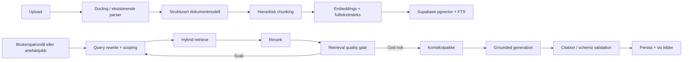
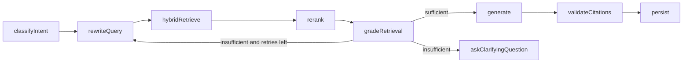

# RAG og agentisk AI-forbedringsplan

Denne vurderingen gjelder den eksisterende `anbud`-appen: en Next.js/Supabase-applikasjon som laster opp tilbuds- og kundedokumenter, analyserer dem med OpenAI, genererer tilbudsartefakter og lar brukeren chatte med prosjektkontekst.

Målet er bedre svarkvalitet, raskere responstid og mer relevante, kildebaserte svar.

## Dagens utgangspunkt

Appen har allerede en viktig del av RAG-grunnmuren:

- Dokumenter parses til `raw_text` og `structure_map` i `apps/frontend/lib/server/documents.ts`.
- Dokumenter chunkes, embeddings opprettes og lagres i Supabase i `apps/frontend/lib/server/document-chunks.ts`.
- Supabase-skjemaet har `document_chunks`, `extensions.vector(1536)` og HNSW-indeks i `supabase/document_chunks_and_embeddings.sql`.
- Opplasting av prosjekt- og tjenestedokumenter trigger best-effort chunk-indeksering i `apps/frontend/lib/server/repositories/supabase-store.ts`.
- Chat og enkelte analyseflyter bruker `retrieveDocumentSnippets()` før modellen svarer.
- Artefaktgenerering har `ensureSemanticChunks`, dokumentledger og batchgenerering for kravsvar.

Det betyr at appen ikke trenger en helt ny RAG-stack. Den trenger en mer presis retrieval-pipeline, bedre ingest, bedre måling og mer kontrollert orkestrering.

## Viktigste mangler

1. **Hybrid search er ikke fullverdig.** Dagens retrieval kombinerer vektorsøk med en in-memory leksikalsk fallback, men Supabase gjør ikke ekte fulltekst/BM25/tsvector-søk med RRF-fusjon.
2. **Ingen reranker.** Kandidater fra vektor/keyword velges direkte med enkel score. Dette er sårbart for chunks som er semantisk like, men ikke svarer på spørsmålet.
3. **Ingen eksplisitt query rewrite.** Chat bruker domenehint, men omskriver ikke oppfølgingsspørsmål til selvstendige, søkbare queries med filtre og eksakte termer.
4. **Ingen retrieval-gate.** Systemet måler ikke om kildene er gode nok før modellen får lov til å svare.
5. **Ingen systematisk retrieval-evaluering.** Det finnes ikke et eval-sett med spørsmål, forventede kilder, recall@k, MRR, faithfulness eller citation accuracy.
6. **Parsing er for svak for vanskelige PDF-er.** Eksisterende PDF-parser er nyttig, men tilbudsdokumenter har ofte tabeller, spalter, skannede sider og vedlegg som krever bedre layoutforståelse.
7. **Promptene får fortsatt for mye råtekst.** Flere flyter sender lange `raw_text`-utdrag i tillegg til retrieval. Det øker latency og kan gjøre konteksten mindre presis.
8. **AI-flyten er ikke modellert som eksplisitt state machine.** Det finnes funksjonelle use-cases, men ikke en tydelig graf med steg, retries, stoppkriterier og sporbar state.

## Anbefalt målarkitektur



## Tiltak per tema

### RAG

RAG bør være standard for alle AI-svar som handler om prosjektinnhold: chat, kundeanalyse, løsningsvurdering, kravsvar, Bilag 1, risiko/gjennomføring og executive summary.

Praktisk endring:

- Gjør `retrieveDocumentSnippets()` obligatorisk i alle genereringsflyter.
- Ikke send store rådokumenter som standard. Send dokumentledger, metadata og utvalgte evidence-pakker.
- Krev at svar med konkrete påstander har kildehenvisning til dokument, seksjon/side og chunk.

Effekt:

- Færre hallusinasjoner.
- Mer etterprøvbare svar.
- Lavere tokenbruk fordi modellen får kortere, mer presis kontekst.

### Chunking

Dagens chunking er tegnbasert med overlapp og noen heuristikker for heading, tabell og krav. Det er et godt startpunkt, men tilbudsdokumenter bør chunkes mer dokumentnært.

Forbedring:

- Bruk hierarki: dokument -> kapittel -> seksjon -> krav/tabellrad -> chunk.
- Bevar krav-ID, vedlegg, tabell-ID, side, overskrift og dokumentrolle som metadata.
- Lag egne chunk-typer for `requirement_row`, `answer_cell`, `evaluation_criteria`, `risk`, `commercial_term` og `architecture_signal`.
- Bruk mindre chunks for krav/tabeller og større chunks for narrativ tekst.
- Bruk parent-child retrieval: hent små presise chunks, men inkluder parent-seksjonen ved generering når det trengs.

Effekt:

- Krav-ID-er og tabeller blir funnet mer presist.
- Modellen får nok kontekst uten at hele dokumentet må inn i prompten.

### Vector database

Supabase med pgvector er riktig valg for denne appen nå. Appen har allerede `document_chunks.embedding` og HNSW-indeks.

Forbedring:

- Behold Supabase/pgvector som primær vektordatabase.
- Legg til query-embedding-cache per normalisert query, prosjekt og dokumentversjon.
- Legg til `embedding_model`, `content_hash` og indeksstatus i UI/observability.
- Kjør backfill for eksisterende dokumenter når migrasjonen er aktiv.

Effekt:

- Raskere retrieval.
- Mindre kostnad på gjentatte søk.
- Bedre driftbarhet fordi man kan se hvilke dokumenter som faktisk er indeksert.

### Hybrid search with rerank

Appen bør gå fra "vector + lexical fallback" til ekte hybrid retrieval:

1. Fulltekst-søk i Postgres med `tsvector`/GIN.
2. Vektorsøk med pgvector/HNSW.
3. Reciprocal Rank Fusion eller vektet score.
4. Rerank av topp 20-40 kandidater.
5. Returner topp 6-12 chunks til prompt.

Viktig sikkerhetspunkt: dagens chunktekst er kryptert i `text_encrypted`. Fulltekstindeks krever enten plaintext, `tsvector`/lexemes eller en separat søkeindeks. Det bør avklares bevisst fordi tsvector kan lekke sensitive ord selv om råtekst er kryptert. Et pragmatisk kompromiss er å lagre `fts tsvector` kun tilgjengelig for `service_role`, og beholde råtekst kryptert.

Effekt:

- Fulltekst fanger eksakte krav-ID-er, versjoner, produktnavn og vedleggsreferanser.
- Semantisk søk fanger intensjon og omskrivninger.
- Rerank fjerner chunks som er like, men irrelevante for akkurat spørsmålet.

### Query rewrite før indeksene

Før søk bør systemet lage en strukturert retrieval-plan:

```json
{
  "standalone_query": "Hva sier kravgrunnlaget om responstid og beredskap for drift?",
  "exact_terms": ["responstid", "beredskap", "SLA", "RTO", "RPO"],
  "filters": {
    "project_id": "...",
    "roles": ["primary_customer_document", "supporting_document"],
    "chunk_kinds": ["requirement", "table", "section"]
  },
  "subqueries": [
    "beredskap drift krav",
    "SLA responstid tilgjengelighet",
    "RTO RPO backup restore"
  ]
}
```

Regler:

- Bruk originalspørsmålet i tillegg til rewrite, ikke erstatt det blindt.
- Rewrite skal være JSON med schema-validering.
- For oppfølgingsspørsmål i chat må rewrite bruke samtaleminne og siste relevante kilder.
- For kravsvar bør rewrite hente ut krav-ID-er deterministisk først, og bare bruke LLM til semantiske omskrivinger.

Effekt:

- Bedre retrieval i chat, spesielt ved korte oppfølgingsspørsmål som "hva med sikkerhet?".
- Mindre risiko for at feil dokumenter eller generelle chunks hentes.

### Measuring retrieval quality før svar

Systemet bør ikke stole på første retrieval-resultat. Innfør to nivåer:

**Online gate per svar**

- `top_score` eller rerank-score må være over terskel.
- Minst ett resultat må matche riktig dokumentscope.
- For spørsmål med eksakte krav-ID-er må ID-en finnes i kildene.
- Kilder må ha nok variasjon, ikke bare duplikater fra samme tekstområde.
- Hvis gate feiler: kjør en ny query med utvidede termer eller be brukeren avklare.

**Offline eval**

Lag et lite eval-sett med 50-100 spørsmål fra testanbud:

- Spørsmål.
- Forventet dokument/chunk/side.
- Forventet kort svar.
- Relevante krav-ID-er.

Mål:

- Recall@5 og Recall@10: finner vi riktig kilde?
- MRR/NDCG: kommer riktig kilde høyt?
- Context precision: hvor mye av konteksten er faktisk relevant?
- Faithfulness/groundedness: støttes svaret av kildene?
- Citation accuracy: peker referansen til riktig dokument/side?
- Latency per steg: rewrite, retrieval, rerank, generation.

Effekt:

- Endringer i chunking, rerank og prompt kan benchmarkes før produksjon.
- Teamet kan se om problemet er retrieval, generering eller dokumentparsing.

### Semantic search

Semantisk søk er allerede delvis på plass med embeddings. Det bør brukes der språket er vagt eller konseptuelt:

- "Hva er kundens egentlige behov?"
- "Hvilke risikoer ligger implisitt i dette?"
- "Finn krav som handler om etterlevelse, sikkerhet og drift."

Det bør ikke brukes alene for:

- Krav-ID-er.
- Versjonsnumre.
- Tabellrader.
- Kontraktsreferanser.
- Produktnavn.

Effekt:

- Bedre svar på konseptuelle spørsmål.
- Mindre feil når eksakte tokens må matches via fulltekst.

### Scoping tools

Agenten må ikke få brede, uavgrensede verktøy. Definer smale server-side tools:

- `searchProjectDocuments(projectId, queryPlan)`
- `searchServiceDocuments(projectId, queryPlan)`
- `getRequirementById(projectId, requirementId)`
- `getDocumentExcerpt(projectId, sourceId, reference)`
- `listGeneratedArtifacts(projectId)`
- `validateCitations(answer, sourceReferences)`

Alle tools må:

- Kreve `projectId`.
- Respektere dokumentroller.
- Returnere begrenset antall tokens.
- Logge input, output, varighet og antall kilder.
- Aldri la modellen skrive SQL eller velge vilkårlige tabeller.

Effekt:

- Agentisk fleksibilitet uten at modellen får ukontrollert tilgang.
- Raskere feilsøking og bedre sikkerhet.

### Hold deterministiske deler deterministiske

Følgende bør være ren kode, ikke LLM:

- Dokument-ID-er, prosjekt-ID-er og tilgangskontroll.
- Parsing av krav-ID-er og sidereferanser når regex/struktur holder.
- Chunk-ID, content hash, deduplisering og sortering.
- RRF-fusjon, terskler og scoreberegning.
- JSON schema validation og artifact validation.
- Citation existence check: finnes sitert chunk faktisk?
- Cache keys, dokumentversjonering og reindex-beslutninger.

LLM bør brukes til:

- Query rewrite.
- Intentklassifisering når regler ikke holder.
- Semantisk vurdering/rerank.
- Generering og språkforbedring.
- Groundedness-vurdering som supplement, ikke eneste kontroll.

Effekt:

- Mer stabile svar.
- Lettere debugging.
- Lavere kostnad fordi LLM ikke brukes på trivielle beslutninger.

### Agentic RAG

Agentic RAG bør ikke brukes for alle spørsmål. En enkel 2-step RAG er raskere og mer forutsigbar for vanlig chat.

Bruk agentic RAG når:

- Spørsmålet krever flere dokumenttyper.
- Svaret må sammenligne kravgrunnlag, løsningsdokument og tjenestekatalog.
- Første retrieval er svak.
- Brukeren ber om analyse, avvik, prioritering eller forbedringsforslag.

Anbefalt agentflyt:

1. Klassifiser intensjon.
2. Lag retrieval-plan.
3. Kjør hybrid retrieval.
4. Rerank.
5. Valider om konteksten er god nok.
6. Hvis svak: rewrite eller hent fra annet scope.
7. Generer svar.
8. Valider kilder og JSON/schema.
9. Lagre svar med retrieval metadata.

Effekt:

- Bedre svar på komplekse spørsmål.
- Kontrollerte retries i stedet for at modellen gjetter.

### Agentic AI

For denne appen bør agentisk AI handle om arbeidsflyter, ikke en fri "autonom agent".

Gode agentiske use-cases:

- "Finn alle krav vi ikke svarer godt nok på."
- "Sammenlign Bilag 2 mot kundens evalueringskriterier."
- "Lag forbedret kravsvar og flagg svake kilder."
- "Foreslå hvilke tjenestebeskrivelser som bør brukes i dette tilbudet."

Hver agentisk jobb bør ha:

- Fast state schema.
- Maks antall iterasjoner.
- Tydelige stoppkriterier.
- Audit logg.
- Mulighet til å vise hvilke kilder/verktøy som ble brukt.

Effekt:

- Mer verdi enn enkel chat.
- Bedre tilbudsarbeid fordi systemet kan jobbe gjennom flere steg, men fortsatt være kontrollerbart.

### Docling før vector DB

Docling er særlig relevant før chunking og embeddings, ikke etterpå.

Anbefaling:

- Legg Docling inn som Python sidecar/worker for PDF, DOCX, PPTX, XLSX og skannede dokumenter.
- Behold eksisterende Node-parser som rask fallback for enkle dokumenter.
- Lagre Docling-output som `docling_json`, markdown og strukturert `structure_map`.
- Bruk Docling metadata for side, bounding boxes, headings, tabeller og leserekkefølge.
- For tabeller: lag både rad-chunks og tabell-sammendrag.
- For skannede PDF-er: bruk OCR og marker OCR confidence i metadata.

Effekt:

- Mye bedre kildegrunnlag for tabeller, vedlegg og skannede anbudsdokumenter.
- Bedre chunking gir bedre embeddings, som gir bedre retrieval og svar.

### Long context window

Lang kontekst bør brukes som sikkerhetsnett, ikke som erstatning for retrieval.

Bruk lang kontekst til:

- Dokumentledger og sammendrag av hele tilbudsgrunnlaget.
- Et lite antall parent-seksjoner rundt de beste chunks.
- Sammenligning av flere korte artefakter.

Unngå:

- Å sende hele `raw_text` for alle dokumenter hver gang.
- Å blande råtekst, retrieval og gamle artefakter uten prioritering.

Effekt:

- Lavere latency.
- Mindre støy i prompt.
- Modellen fokuserer på relevant evidence.

### Context engineering

Prompt-kontekst bør bygges som en strukturert evidence-pakke:

1. Oppgave og outputkontrakt.
2. Prosjektmetadata.
3. Dokumentledger.
4. Retrieval-plan.
5. Kildepakker sortert etter rerank-score.
6. Eksakte krav/tabellrader.
7. Tidligere artefakter bare hvis de er relevante.
8. Regler for når modellen skal si "ikke nok grunnlag".

Hver kildepakke bør inneholde:

- `chunk_id`
- `document_title`
- `document_role`
- `reference`
- `page_start/page_end`
- `heading_path`
- `score`
- `excerpt`

Effekt:

- Bedre svar fordi modellen ser hva som er bevis og hva som er instruks.
- Bedre kildevisning i UI.

### Orchestrating state med LangGraph

LangGraph passer best for de komplekse, flertrinns AI-jobbene i appen. Appen er TypeScript-basert, så `@langchain/langgraph` kan brukes hvis teamet vil holde orkestreringen i samme runtime.

Foreslått state:

```ts
type RagWorkflowState = {
  projectId: string;
  userInput: string;
  intent: "chat" | "customer_analysis" | "requirement_answer" | "solution_evaluation";
  queryPlan?: QueryPlan;
  retrieved?: RetrievedDocumentSnippet[];
  reranked?: RetrievedDocumentSnippet[];
  retrievalQuality?: {
    sufficient: boolean;
    recallSignals: string[];
    missingSignals: string[];
  };
  answer?: string;
  citations?: ChatSourceReference[];
  errors?: string[];
};
```

Foreslått graf:



Effekt:

- Bedre kontroll på retries, state og observability.
- Mer robust enn lange funksjoner med implisitte sideeffekter.
- Lettere å teste hvert steg isolert.

## Prioritert implementeringsplan

### Fase 1: Stabiliser eksisterende RAG

- Verifiser at `supabase/document_chunks_and_embeddings.sql` er kjørt i alle miljøer.
- Lag backfill-jobb som indekserer alle eksisterende dokumenter.
- Logg retrieval metadata for chat og artefakter: query, source IDs, chunk IDs, scores, timings og antall tokens.
- Vis "kildegrunnlag" tydelig i UI.

### Fase 2: Ekte hybrid search

- Legg til `fts tsvector` eller separat søkeindeks for chunks.
- Implementer Supabase RPC `hybrid_match_document_chunks`.
- Bruk RRF mellom fulltekst og vektor.
- Skill `semantic_score`, `keyword_score`, `rrf_score` og `final_score`.

### Fase 3: Query rewrite, rerank og quality gate

- Lag `buildRetrievalPlan()` som returnerer validert JSON.
- Implementer rerank for topp 20-40 chunks.
- Innfør retrieval-gate før generering.
- Ved svak retrieval: prøv én kontrollert rewrite/retrieve-runde før svar.

### Fase 4: Docling-ingestion

- Legg til Python worker eller sidecar.
- Bruk Docling for PDF/DOCX/XLSX med tabeller, OCR og layout.
- Lag ny dokumentstruktur med Docling metadata.
- Reindekser testdokumenter og mål effekt mot eval-sett.

### Fase 5: Eval og observability

- Lag `rag_eval_cases` med spørsmål, forventet kilde og forventet svar.
- Lag script for recall@k, MRR, context precision, groundedness og citation accuracy.
- Kjør eval før/etter hver retrieval-endring.
- Lag latency-dashboard per steg.

### Fase 6: LangGraph for komplekse workflows

- Start med prosjektchat eller forbedret kravsvar.
- Ikke migrer alt samtidig.
- Hold dagens deterministiske use-cases som noder.
- Bruk LangGraph til state, branching, retries og trace, ikke til å erstatte domenelogikk.

## Høyest avkastning først

1. **Retrieval logging + eval-sett.** Uten dette vet dere ikke om endringer hjelper.
2. **Ekte hybrid search i Supabase.** Dette vil gi stor effekt for krav-ID-er, tabeller og kontraktsreferanser.
3. **Query rewrite for chat og artefakter.** Dette løser mange irrelevante retrievals.
4. **Rerank + quality gate.** Dette reduserer dårlige svar fra svakt kildegrunnlag.
5. **Docling for vanskelige dokumenter.** Dette forbedrer alt nedstrøms fordi bedre parsing gir bedre chunks.
6. **LangGraph for agentiske flows.** Dette er mest verdifullt når retrieval og eval er stabilt.

## Konklusjon

Appen bør utvikles fra en delvis RAG-aktivert dokumentgenerator til en målt, hybrid og kildevalidert AI-arbeidsflate for tilbud. Det viktigste er ikke mer agentisk frihet, men bedre evidence pipeline:

`bedre ingest -> bedre chunks -> hybrid retrieval -> rerank -> quality gate -> kort presis kontekst -> grounded generation -> citation validation`.

Agentic RAG og LangGraph bør innføres etter at retrieval-kvaliteten kan måles. Da kan agenten ta bedre beslutninger uten å skjule feil i parsing, søk eller kildegrunnlag.

## Kilder

- Docling dokumentasjon: https://docling-project.github.io/docling/
- Docling hybrid chunking: https://docling-project.github.io/docling/_generated/examples/hybrid_chunking/
- Docling chunking-konsepter: https://docling-project.github.io/docling/concepts/chunking/
- Docling RAG med LangChain: https://docling-project.github.io/docling/_generated/examples/rag_langchain/
- Supabase hybrid search: https://supabase.com/docs/guides/ai/hybrid-search
- LangChain retrieval/RAG-arkitekturer: https://docs.langchain.com/oss/python/langchain/retrieval
- LangGraph Graph API: https://docs.langchain.com/oss/python/langgraph/graph-api
- LangGraph.js StateGraph: https://langchain-ai.github.io/langgraphjs/reference/classes/langgraph.StateGraph.html
- LangSmith RAG-evaluering: https://docs.langchain.com/langsmith/evaluate-rag-tutorial
- Ragas metrics: https://docs.ragas.io/en/latest/concepts/metrics/available_metrics/
- OpenAI retrieval/vector stores: https://developers.openai.com/api/docs/guides/retrieval
- NVIDIA RAG query-to-answer pipeline: https://docs.nvidia.com/rag/latest/query-to-answer-pipeline.html
